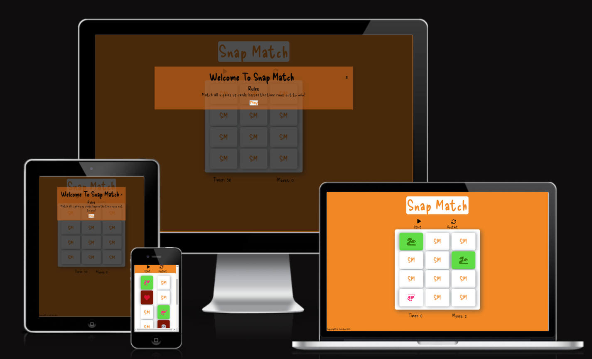

# **Snap Match**
This website is a card matching game. You have a limited amount of time to find all the pairs. This wesbite is aimed at people of all ages that would like to play a simple memory based game for entertainment purposes.

Access the site here: https://joslaw.github.io/snap-match/

 
## **Goals/Expectations**
1. Provide a set of matching cards for the game
2. Set an achieveable objective for the game. 30 second timer
3. Give visual feedback for user interaction. Red for unmatched cards, green for matched cards, and alerts for completion or game over

---

## Design

The website uses a basic colour pallete of orange, white, and black, that is bright and vibrant to keep user attention. The font is an imported font called Delicious Handrawn. The header is the reverse colours of the favicon, with the font colour of the rest of the text being black.
The initial layout was planned using a programme called balsamiq to create the wireframe. The end product was adapted over the course of creation, and then further changed after user feedback. You can find the wireframe here:

## Future Updates

* Add more cards to create a larger game board and increase the difficulty. 
* Create two modes that increase or decrease the difficulty. This will be achieved by creating two timers, 30 seconds and 60 seconds. The user will have the ability to select which timer they would like to use for the game play.

---
## Features
### **Header**
The header contains the name of the game. The text is large in line witht he colour palette, with a white background to make it stand out
### **Game**
The game area is white with a box shadow around each card. This gives the illusion of of raised elements. 
### **Moves**
The moves counter is in black to provide enough contrast from the bright orange background. The counter will go up when 2 cards are clicked to be assessed for matches
### **Timer**

---
## Footer

---
## Testing

---
## Bugs
---
## Validator Testing
---
## Technologies
* HTML
* CSS
* Javascript
* Git
* Github
---
## Deployment
---
## References/Credit
1. [Google Fonts](https://fonts.google.com/) - Create and import font
2. [Favicon](https://favicon.io/logo-generator/) - Create the favicon
3. [Flip Cards](https://www.w3schools.com/howto/howto_css_flip_card.asp) - Assist with flip card layout
4. [Color Generator](https://coolors.co/f28824-ffffff-e6e8e6-ced0ce-191919) - Generate color
5. [Font Awesome](https://fontawesome.com/) - Icons for the cards
6. [Emojipedia](https://emojipedia.org/grinning-face-with-smiling-eyes/) - Emoji for the alert messages
7. [Code Snippets](https://github.com/sandraisrael/Memory-Game-fend) - Code snippets for game functionality and layout of game area
8. [Modal](https://www.w3schools.com/howto/howto_css_modals.asp) - Create modal
9. [Multiple Functions](https://stackoverflow.com/questions/3910736/how-to-call-multiple-javascript-functions-in-onclick-event) - Code syntax to fire multiple functions
10. [Countdown Timer](https://www.w3schools.com/jsref/met_win_setinterval.asp) - Code syntax for timer
11. [Event Listeners](https://stackoverflow.com/questions/25028853/addeventlistener-two-functions) - Syntax for event listeners for mulitple functions
12. [Timeout](https://www.w3schools.com/jsref/met_win_settimeout.asp) - Syntax for timeout on gameOver function
13. [Alert](https://stackoverflow.com/questions/24768067/display-alert-only-once) - Solution to trigger alert once
14. [Timer](https://stackoverflow.com/questions/31036619/timer-goes-twice-as-fast-when-triggered-again) - Solution to timer going twice as fast